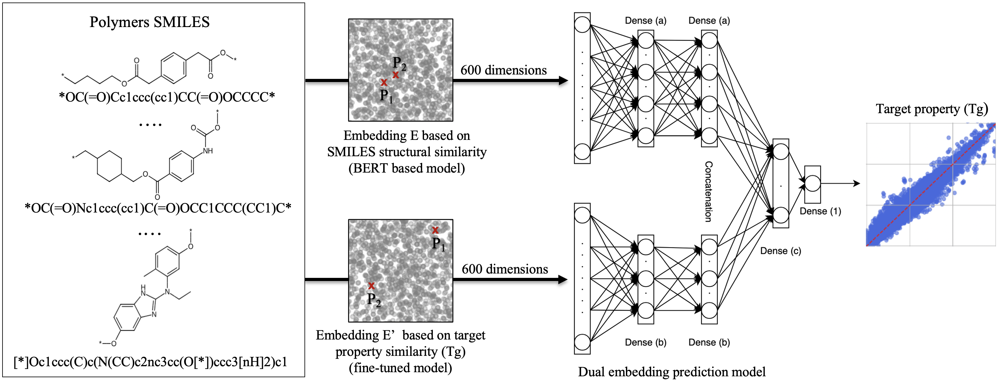

# Dual Embedding


## Overview



***

This overview displays the main sections of CCASL, known as:
- [ ] 3.1 From Domain Knowledge to a Corpus of PDF Documents (A,B)
- [ ] 3.2 Creation of a Consolidated View of the Publications' Relevant Tables (C)
- [ ] 3.3 Counterexample Detection with g3-Relaxed Equality on Adesit (D)
***

## 3.1 PDF Document Acquisition

The first step is the creation of a PDF database related to your study. 
In this application, parameters have been set in the Python files. 
A sample of the downloaded PDFs is provided in the 'Data Samples' folder.
- [ ] `Approach_a_Journal.py` : Publications extracted from 11 target journals
- [ ] `Approach_b_GoogleScholar.py` : exploits google scholar
- [ ] `Data_Samples` : Sample of 682 PDFs (approach-a) over 3400, and all the 682 of (approach-b), download [here](https://zenodo.org/records/15115892).
```
python3.9 file.py
```
***

## 3.2 Consolidated View of Tabular Data

This is the most important part of the work because it contains the programs for extraction, relevance recommendation, table normalization, and data integration. 
These programs can be executed in the following order
- [ ] `Table_Extraction.py`: Captures all the tables in a PDF.
- [ ] `Recommendation.py`: Classifies images of tables based on their relevance using keywords.
- [ ] `textract.py` : Contains the code for image preprocessing, and the connection to the Amazon Textract API, but we recommend using the web interface, which also offers a free trial [AWSTextract](https://aws.amazon.com/fr/textract/).
- [ ] `Normalization.py` & `Samples_Normalization.py`: A global rule-based program designed to normalize certain frequent attributes (e.g., chemical properties) in epoxy-amine publications.
- [ ]  `RNN_column_name.py` : A machine learning-based approach for attribute name normalization using RNN.
- [ ] `ChemDataExtractor.py`: is use in `Normalization.py` to detect acronym and abbreviation, notably 'EP' which is usually describe in "Experimental and method".
- [ ] `Data_Integration.py`: Creates an integrated view of the case study from the paper (V(EA), SM_bf, SM_af, Tg).
- [ ] `Data`: Contains samples of intermediate results, more data is given on [zotero](https://zenodo.org/records/15115892).
***

## 3.3 CounterExample detection

- [ ] The file `Tg_SM.xlsx` contains the results of `Data_Integration.py`, after cleaning, the results are saved in: `Tg_SM_clean.xlsx`.
- [ ] Use the file `Tg_SM_clean.csv` to visualize counterexamples on [ADESIT](https://adesit.liris.cnrs.fr/).
- [ ] The file `CCASL_counterexamples.xlsx` Contains highlighted counterexamples for the following parameters: ε_bf = 330 MPa, ε_af = 8 MPa, and ε_Tg = 12°C.

***

## Associated paper
In peer review "CCASL: Counterexamples to Comparative Analysis of Scientific Literature - Application to Polymers." *Journal of Intelligent Information Systems*.
